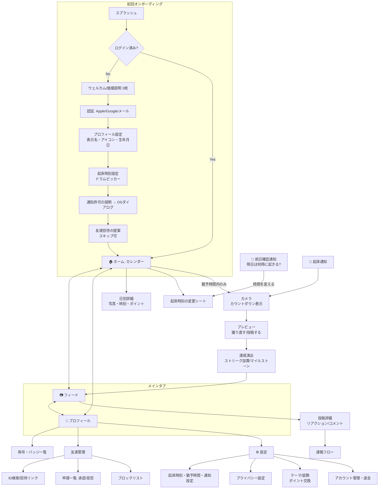
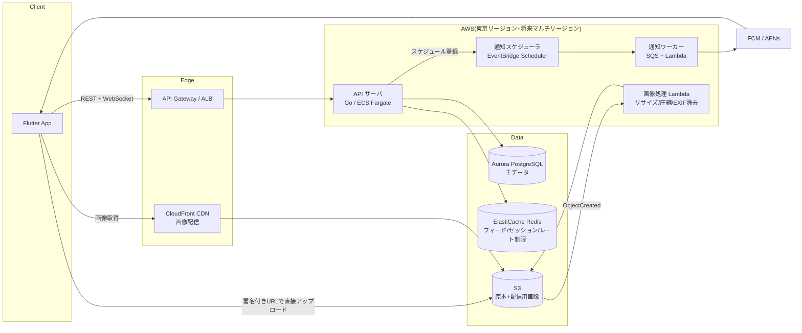
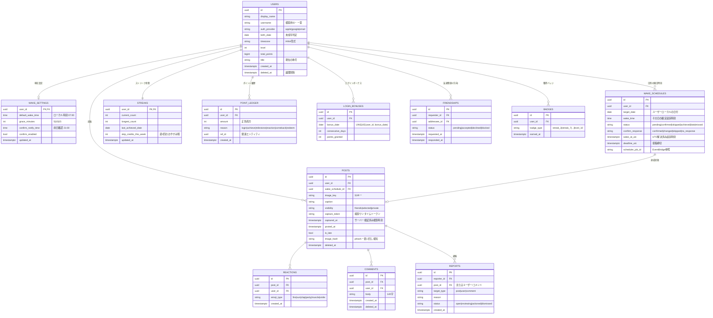
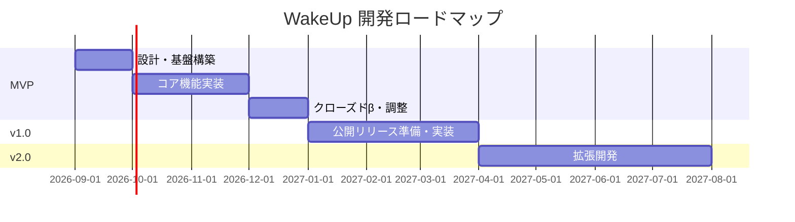

# WakeUp — 早起き習慣化アプリ プロダクト設計書

> 「毎朝、起きた瞬間を写真で証明する」ことで早起きを習慣化し、自己規律を高めるモチベーションアプリ。
> BeReal の「その瞬間を撮る」体験をベースにしつつ、目的は日常共有ではなく **早起きの継続による自己成長**。

---

## 目次

1. [プロダクト要件定義](#1-プロダクト要件定義)
2. [機能仕様（ユーザーストーリー）](#2-機能仕様ユーザーストーリー)
3. [画面設計](#3-画面設計)
4. [技術アーキテクチャ](#4-技術アーキテクチャ)
5. [非機能要件](#5-非機能要件)
6. [開発ロードマップ](#6-開発ロードマップ)

---

## 1. プロダクト要件定義

### 1.1 ターゲットユーザー（ペルソナ）

#### ペルソナ A：「朝活したい社会人」佐藤ミナ（26歳・IT企業勤務）

| 項目 | 内容 |
|---|---|
| 生活 | 平日はリモートと出社が半々。就寝は 0〜1 時、起床は 8 時ギリギリ |
| 課題 | 「朝活で勉強・運動したい」と思いつつ二度寝で挫折を繰り返す。目覚ましアプリは止めて終わり |
| 動機 | 意志力ではなく「仕組み」で起きたい。頑張りを誰かに見てもらえると続くタイプ |
| WakeUp との接点 | 仲の良い同僚 2〜3 人と相互フォローし、朝の証拠写真を見せ合う。ストリークが伸びるのが快感 |

#### ペルソナ B：「試験勉強中の大学生」田中ケイ(20歳・大学2年)

| 項目 | 内容 |
|---|---|
| 生活 | 授業時間が日によってバラバラ。1 限がある日は 7 時起き、ない日は 10 時起きと起床時刻が変動 |
| 課題 | 生活リズムが崩れがち。資格試験に向けて朝型に矯正したいが、固定時刻の目覚ましアプリが生活に合わない |
| 動機 | ゲームのデイリーミッションを欠かさないタイプ。ログインボーナスやレベルアップに強く反応する |
| WakeUp との接点 | **前日確認通知**で翌日の起床時刻を柔軟に変えられる点が刺さる。サークル仲間とゆるく競う |

#### ペルソナ C：「習慣化オタクのフリーランス」山本リョウ(34歳・デザイナー)

| 項目 | 内容 |
|---|---|
| 生活 | 出社義務がなく生活が夜型に流れやすい。Streaks や Habitica など習慣化アプリの経験者 |
| 課題 | チェックボックスを押すだけの習慣化アプリは「押すだけで実際はやってない」自己欺瞞に陥りがち |
| 動機 | **証拠が残る**仕組みに価値を感じる。数字とカレンダーで自分の規律を可視化したい |
| WakeUp との接点 | 友達は少数(妻・友人 1 人)。ソーシャルより記録・ストリーク・称号を重視するソロプレイヤー |

### 1.2 コアバリューと差別化ポイント

**コアバリュー：「起きた瞬間の写真」という改ざんしにくい証拠を毎日積み上げることで、早起きを"自分との約束を守った記録"に変える。**

| 比較対象 | 相手の提供価値 | WakeUp の差別化 |
|---|---|---|
| BeReal | ランダムな時刻に「今」を友達と共有するリアルさ | 時刻はランダムではなく**自分で決めた起床時刻**。共有が目的ではなく**達成の証明**が目的。公開フィード・Discovery を持たず、友達のみの閉じた空間 |
| 一般的な目覚ましアプリ(Alarmy 等) | ミッション(計算・写真)でアラームを止めさせ、その場で起こす | 起こして終わりではなく、**達成が記録・ストリーク・レベルに蓄積**され、翌日以降のモチベーションになる。友達の存在がゆるい社会的コミットメントとして働く |
| 習慣化アプリ(Streaks, みんチャレ等) | チェックイン式の習慣トラッキング | チェックボックスは自己申告だが、WakeUp は**その場で撮った写真のみ**を達成条件とし、自己欺瞞を構造的に防ぐ。「起床」という単一習慣に特化し、前日確認通知など起床特有の UX を磨き込む |
| ソーシャル習慣化(みんチャレ) | 匿名 5 人チームの相互監視 | 匿名他人ではなく**実際の友達**。監視ではなく「見せ合って褒め合う」ポジティブな関係設計。リアクションは称賛系のみ |

**設計原則(全機能に適用):**

1. **証拠性** — 達成はアプリ内カメラでその場で撮影した写真のみで成立する
2. **内発的動機** — 物的リワードは一切なし。演出・称号・記録の美しさで「続けたい」を作る
3. **閉じた安心感** — 公開フィードなし。写真を見るのは承認した友達だけ
4. **失敗に優しい** — 未達成の日を責めない。翌日また始めればよいトーンを UI 全体で貫く

### 1.3 MVP スコープ

| 含める(MVP) | 含めない(MVP 外) | 理由 |
|---|---|---|
| メール/Apple/Google 認証 | 電話番号認証、匿名利用 | 認証手段は最小限で十分。SMS はコスト増 |
| 起床時刻設定+前日確認通知 | 曜日別の繰り返しテンプレート(v1.0 へ) | 前日確認がコア体験。テンプレートは利便性向上なので後回し |
| 起床通知 → アプリ内カメラ撮影 → 投稿 | 動画投稿、BeReal 式の内外カメラ同時撮影 | 静止画 1 枚で証明は成立。同時撮影は演出であり必須ではない |
| カレンダー記録(達成/未達成/休み) | 統計ダッシュボード(週次推移グラフ等、v1.0 へ) | カレンダーが最小の振り返り体験 |
| ストリーク+マイルストーン演出 | 称号のコレクション画面の拡充(v1.0 へ) | ストリーク演出は差別化の核なので MVP に必須 |
| ログインボーナス+ポイント+レベル | ポイントで解放するテーマ/フレーム(v1.0 へ) | 加算とレベル表示までを MVP、使い道の拡張は後続 |
| 友達フィード(友達のみ)+リアクション | コメント(v1.0 へ)、グループ機能 | まず「見て褒める」最小ループ。コメントはモデレーション負荷があるため通報機能拡充とセットで v1.0 |
| 友達申請/承認/削除/ブロック | 連絡先同期による友達推薦(v1.0 へ) | 招待リンクで足りる。連絡先同期はプライバシー審査負荷が高い |
| 通報機能(写真・ユーザー) | — | 未成年保護・ストア審査の観点で MVP から必須 |
| 不正防止の基本(カメラロール禁止・サーバー時刻検証) | ML による画像解析(寝床検知等) | 基本対策で 9 割防げる。高度な検証は費用対効果を見て v2.0 |

### 1.4 KPI 設計

**North Star Metric:週あたり起床達成日数の合計(全ユーザー)** — 「早起きの継続」という提供価値そのものを測る。

| カテゴリ | KPI | 定義 | 初期目標(リリース 3 ヶ月) |
|---|---|---|---|
| 継続 | DAU / MAU | 日次・月次アクティブ率 | DAU/MAU 40%以上(習慣アプリとして高水準を狙う) |
| 継続 | D1 / D7 / D30 リテンション | 初回投稿日を起点 | D7 35% / D30 20% |
| コア体験 | **起床達成率** | 起床通知を受けたユーザーのうち制限時間内に投稿した割合 | 55%以上 |
| コア体験 | **平均連続達成日数** | アクティブユーザーの現在ストリークの平均 | 4 日以上 |
| コア体験 | **通知→投稿までの時間(中央値)** | 起床通知送達から投稿完了まで | 8 分以内(猶予 15 分に対し) |
| コア体験 | **前日確認通知への応答率** | 前夜の確認通知に対し時刻確定/変更操作をした割合 | 60%以上(応答者は翌朝の達成率が高い仮説を検証) |
| ソーシャル | 友達 1 人以上の割合 | 登録 7 日以内に相互友達 1 人以上 | 50%(友達有無で D30 を比較し因果を検証) |
| ソーシャル | リアクション率 | 友達の投稿を閲覧したユーザーがリアクションする割合 | 30% |
| エンゲージ | ストリーク復帰率 | ストリークが途切れた後 3 日以内に投稿を再開した割合 | 40%(「失敗に優しい」設計の効果測定) |

**計測上の注意:** 起床達成率は「通知が実際に届いたユーザー」を分母にする(OS の通知権限 OFF を除外)。前日確認応答率と翌朝達成率のクロス分析を最初から計装しておく。

---

## 2. 機能仕様(ユーザーストーリー)

### 2.1 会員登録・ログイン

- **新規ユーザーとして**、Apple/Google アカウントで 30 秒以内に登録を終えたい。**なぜなら**、寝る前や思い立った瞬間の熱が冷めないうちに始めたいから。
- **新規ユーザーとして**、登録直後のオンボーディングで起床時刻・通知許可・プロフィール(表示名+アイコン)だけを設定したい。**なぜなら**、入力項目が多いと離脱してしまうから。
- **復帰ユーザーとして**、機種変更後も同じアカウントでログインして記録とストリークを引き継ぎたい。**なぜなら**、積み上げた記録こそがこのアプリを使う理由だから。

**仕様要点:**
- 認証方式:Sign in with Apple / Google / メールアドレス+パスワード(Apple 審査上、Apple サインイン必須)
- 登録時に生年月日を取得(未成年保護の年齢判定に使用。§5.3)
- 通知許可はオンボーディング内で「なぜ必要か」を説明する専用画面を挟んでから OS ダイアログを出す(許諾率向上)

### 2.2 起床時刻の初期設定と変更(前日確認通知を含む)

- **新規ユーザーとして**、オンボーディングで明日の起床時刻をドラム式ピッカーで設定したい。**なぜなら**、最初の一歩を迷わず踏み出したいから。
- **予定が不規則なユーザーとして**、前日の夜に「明日は何時に起きますか?」という通知を受け取り、通知から**ワンタップで時刻を確定・変更**したい。**なぜなら**、翌朝の予定は前夜にならないと確定しないことが多いから。
- **ユーザーとして**、前日確認に応答しなかった場合は前回の設定時刻がそのまま適用されてほしい。**なぜなら**、応答を忘れただけで翌朝の挑戦が無効になるのは理不尽だから。
- **ユーザーとして**、明日は挑戦しない「おやすみ(スキップ)」を前夜に宣言したい。**なぜなら**、旅行や体調不良の日まで未達成と記録されるとやる気を失うから。

**仕様要点:**
- 前日確認通知の送信時刻:デフォルト 21:00(ユーザー変更可、20:00〜23:00 推奨)
- 通知はリッチ通知(Notification Actions)で「👍 このまま(7:00)」「時間を変える」「明日はおやすみ」の 3 択
- 「時間を変える」タップでアプリの時刻変更シートを直接開く(ディープリンク)
- 当日の起床時刻変更は**起床時刻の 1 時間前まで**可能(直前に後ろ倒しして達成を偽装する抜け道を防ぐ)
- スキップ宣言はカレンダー上「休み」として達成とも未達成とも区別して表示。**ストリークは加算されないが途切れもしない**(週 2 回まで。無制限だとストリークが形骸化するため)

### 2.3 起床通知と投稿までの制限時間

- **ユーザーとして**、設定した起床時刻ちょうどに通知(アラーム的な強い通知)を受け取りたい。**なぜなら**、それが目覚ましの代わりになるから。
- **ユーザーとして**、通知から一定の猶予時間内に写真を投稿すれば「達成」になってほしい。**なぜなら**、目を覚まして体を起こし、カメラを構えるまでの現実的な時間が必要だから。
- **ユーザーとして**、残り時間がアプリ内でカウントダウン表示されてほしい。**なぜなら**、締切の緊張感が二度寝の抑止になるから。

**猶予時間の設計(提案):デフォルト 15 分**

| 案 | メリット | デメリット | 判定 |
|---|---|---|---|
| 2 分(BeReal 同等) | 緊張感最大、二度寝ほぼ不可能 | 寝起きの認知能力では厳しすぎて達成率が下がり、挫折→離脱を招く | ✕ |
| 5〜10 分 | 二度寝抑止力が強い | トイレ・家族対応などの現実的な割り込みで失敗しやすい | △(ハードモードとして提供) |
| **15 分** | 「目覚める→体を起こす→撮る」に十分。二度寝(通常 20 分以上)には足りない絶妙なライン | 緊張感はやや薄い | **◎ デフォルト採用** |
| 30 分以上 | 達成率は上がる | 「一度起きて二度寝しても間に合う」ため起床の証明として成立しない | ✕ |

- 猶予は 5 / 10 / 15 分から選択可(短いほど後述のボーナスポイント係数が高く、緊張感を自分で選べる)
- 通知は起床時刻に 1 回+未反応なら 3 分後・7 分後にリマインド(計 3 回)
- 猶予超過後の投稿は「遅刻達成」として記録は残るがストリーク・当日ボーナスは対象外(記録が完全に消えるより挫折感が少ない)

### 2.4 写真撮影・投稿(起床の証明として成立するフロー)

- **ユーザーとして**、起床通知をタップしたら**即カメラが起動**してほしい。**なぜなら**、寝起きの頭で操作に迷いたくないから。
- **ユーザーとして**、撮影→投稿が 2 タップで完了してほしい。**なぜなら**、フィルタや編集で悩む体験はこのアプリには不要だから。
- **サービス提供者として**、カメラロールからの選択・スクリーンショット・過去写真の再利用を禁止したい。**なぜなら**、証拠性がこのアプリの価値の根幹だから。

**撮影フロー仕様:**
1. 起床通知タップ → アプリ内カメラ直行(カウントダウン残り時間を上部に常時表示)
2. イン/アウトカメラ切替可。フラッシュ可。**編集・フィルタ・カメラロール選択は不可**
3. 撮影 → プレビュー(「撮り直す」「投稿する」の 2 択のみ)→ 投稿
4. 投稿完了と同時に達成確定演出(§3.3)→ そのままフィードへ遷移
5. 撮り直しは猶予時間内なら回数無制限(撮り直し履歴はサーバーに記録し不正分析に利用)
6. キャプションは投稿後に任意で追記可能(投稿前の必須入力にしない — 投稿完了までの摩擦を最小化)
7. オフライン時:撮影時刻を端末で記録しローカル保存 → 通信回復後にアップロード。サーバーは撮影時に発行済みのワンタイムトークン(§4.5)で撮影時刻の正当性を検証

### 2.5 カレンダー形式の記録画面(ホーム)

- **ユーザーとして**、今月のカレンダーで達成(写真サムネイル)・未達成・休みが一目でわかるようにしたい。**なぜなら**、埋まっていくカレンダーそのものが報酬だから。
- **ユーザーとして**、過去の任意の日をタップしてその日の写真と起床時刻を見返したい。**なぜなら**、「あの頃の自分も頑張ってた」ことが今日のモチベーションになるから。
- **ユーザーとして**、月ごとの達成率と現在/最長ストリークを常に確認したい。**なぜなら**、数字の伸びが自己規律の成長を実感させてくれるから。

**仕様要点:**
- カレンダーのセル表示:達成=写真サムネイル、遅刻達成=サムネイル+時計バッジ、未達成=グレー、休み=💤、未来=空欄
- ヘッダーに「現在ストリーク 🔥N 日」「最長記録」「今月の達成率」を常設
- 月送りで過去全期間を遡れる。日タップで詳細(写真・起床予定時刻・実際の投稿時刻・獲得ポイント)
- このカレンダー画面をアプリのホーム(起動直後の画面)とする — 「自分の記録」が主役であり、フィードは従

### 2.6 連続達成ストリークと褒める演出

- **ユーザーとして**、連続達成日数の節目で盛大に褒められたい。**なぜなら**、誰にも褒められない自分との約束を、アプリだけは見ていてくれるから。
- **ユーザーとして**、ストリークが途切れたときに責められたくない。**なぜなら**、罪悪感は再開の最大の敵だから。

**マイルストーン段階設計:**

| 連続日数 | 演出レベル | 称号バッジ | 演出内容 |
|---|---|---|---|
| 3 日 | ★ | 「三日坊主バスター」 | 投稿直後に紙吹雪+バッジ授与モーダル |
| 5 日 | ★ | 「朝焼けランナー」 | 同上+フィードに友達へ通知される達成カード |
| 7 日 | ★★ | 「一週間の証人」 | 全画面の朝焼けアニメーション+週間カレンダーが金色に |
| 10 日 | ★★ | 「二桁の壁を越えし者」 | 同上+プロフィールにバッジ常設 |
| 14 / 21 日 | ★★ | 「習慣の芽」「習慣の若木」 | 習慣形成の科学(21 日説)に触れる称賛メッセージ |
| 30 日 | ★★★ | 「月間皆勤の朝マスター」 | 最大演出:日の出ムービー+30 日分の写真がモザイクアートに合成される特別カード(保存・共有可) |
| 50 / 100 日 | ★★★ | 「早起きの求道者」「百日の伝説」 | 100 日はアプリアイコン変更権(内発的報酬の最高峰)を解放 |
| 以降 50 日毎 | ★★★ | 動的生成 | 演出のインフレを防ぐため 100 日以降は簡潔かつ荘厳なトーンに |

- マイルストーン間の日も、投稿完了時に必ず 1 行の称賛メッセージ+ポイント加算演出を出す(無音の日を作らない)
- **途切れた日の設計:**翌日の通知文言は「また今日から始めよう。最長記録 N 日はあなたの実力です」。復帰初回達成に「おかえりボーナス」ポイントを付与(途切れの罰ではなく再開の祝福)
- 友達がマイルストーン達成した際はフィードに達成カードが流れ、専用リアクション「🎉」が打てる

### 2.7 ログインボーナスとポイント/レベル設計

- **ユーザーとして**、アプリを開くだけでも毎日ポイントが貯まってほしい。**なぜなら**、起床に失敗した日でもアプリとの接点を失いたくないから(離脱防止)。
- **ユーザーとして**、貯めたポイントでレベルや称号、演出の変化を楽しみたい。**なぜなら**、数字と見た目の成長が続ける理由になるから。

**ポイント設計:**

| 行動 | ポイント | 備考 |
|---|---|---|
| ログイン(日次) | +5 | 連続ログイン 7 日目は +20(週次の山を作る) |
| 起床達成 | +20 | 猶予 10 分設定なら×1.2、5 分なら×1.5(緊張感の自己選択に報いる) |
| 遅刻達成 | +5 | ゼロにしない(記録は続ける価値があると伝える) |
| ストリークマイルストーン | +30〜+300 | 節目の大きさに比例 |
| 友達の投稿へのリアクション | +2(日上限 10) | ソーシャル行動の習慣づけ。上限で farming 防止 |
| 復帰初回達成(おかえりボーナス) | +15 | 途切れ後 3 日以内の再開時 |

**レベル/称号設計:**
- レベルは累計ポイントで単調増加(下がらない)。Lv 上限なし、必要ポイントは緩やかな逓増
- レベル帯ごとに称号が変化:「朝の見習い(Lv1)→ 朝活ルーキー(Lv5)→ 早起き職人(Lv10)→ 朝の達人(Lv20)→ 日の出の覇者(Lv30)→ …」
- ポイントの使い道(すべて内発的・装飾的):カレンダーテーマ(朝焼け/森/海)、プロフィールフレーム、達成スタンプの絵柄、投稿カードの装飾。**ガチャ・換金・機能アンロックには一切使わない**(機能格差は規律の平等性を壊す)

### 2.8 フィード(友達のみ)

- **ユーザーとして**、今日の友達の起床写真だけが並ぶフィードを見たい。**なぜなら**、「みんなも起きてる」ことが自分の背中を押すから。
- **ユーザーとして**、知らない人の投稿は一切見たくない。**なぜなら**、寝起きの無防備な写真は友達にしか見せられないから。

**仕様要点:**
- フィードは相互承認済み友達の**当日の投稿のみ**を時系列表示(過去分は各友達のプロフィールから)
- 公開フィード・Discovery・ハッシュタグ・検索経由の投稿露出は**存在しない**(仕様として明文化)
- BeReal 式の「自分が投稿するまで友達の投稿はぼかし表示」を採用 — 見る側に回るだけのユーザーを作らず、投稿インセンティブを強化。ただし当日スキップ宣言者と猶予時間前のユーザーには通常表示(不公平感の回避)
- 各投稿カード:写真、名前、実際の起床時刻(「7:02 に起床 ⏰7:00 設定」)、現在ストリーク 🔥、リアクション

### 2.9 リアクション・コメント機能

- **ユーザーとして**、友達の起床にワンタップで「えらい!」を伝えたい。**なぜなら**、朝の忙しい時間に長文は書けないが称賛は送りたいから。
- **ユーザーとして**、ネガティブな反応をもらう心配なく投稿したい。**なぜなら**、寝起き写真は精神的にも無防備だから。

**仕様要点:**
- リアクションは称賛系の固定 6 種のみ:「🔥 えらい」「☀️ おはよう」「👏 拍手」「🎉 おめでとう」「💪 ナイス」「😊 いいね」— ネガティブ・嘲笑系の絵文字は選択肢に置かない(構造的ないじめ防止)
- コメント(v1.0):テキスト 140 字。投稿者は投稿単位でコメント可否を設定可能。NG ワードフィルタ+通報対応とセットでリリース
- リアクションはプッシュ通知(まとめ配信:「3 人が今朝の投稿に 🔥 しました」)

### 2.10 友達管理(申請・承認・ブロック)

- **ユーザーとして**、ユーザー ID 検索か招待リンクで友達申請を送りたい。**なぜなら**、リアルの友達を誘う導線がシンプルであってほしいから。
- **ユーザーとして**、申請は承認制にしたい。**なぜなら**、承認した相手だけに写真が見えることが安心の前提だから。
- **ユーザーとして**、関係を切りたい相手をブロックし、相手に通知されないでほしい。**なぜなら**、角を立てずに距離を置きたいから。

**仕様要点:**
- 友達成立は相互承認のみ。フォロー(片方向)の概念は持たない
- 招待リンク:未登録者にはストア誘導 → 登録完了後に自動で申請が届く(K-factor 計測ポイント)
- 友達上限 50 人(親密な少人数設計を仕様で強制。BeReal 初期と同思想)
- ブロック:相手からは友達リストから消えるだけで通知されない。過去のリアクション・コメントも相互に非表示
- 友達削除とブロックを別操作として提供(削除=再申請可能、ブロック=申請も不可)

### 2.11 プライバシー設定と通報機能

- **ユーザーとして**、自分の投稿の公開範囲を制御したい(全友達/選択した友達/自分のみ)。**なぜなら**、日によっては誰にも見せたくない朝もあるから。
- **ユーザーとして**、不適切な投稿・ユーザーを簡単に通報したい。**なぜなら**、閉じた空間でも不快なコンテンツに遭遇しうるから。
- **保護者・運営として**、未成年ユーザーが安全に使える初期設定にしたい。**なぜなら**、写真共有アプリの未成年保護は法的・倫理的義務だから。

**仕様要点:**
- 投稿単位の公開範囲:全友達(デフォルト)/ 選択友達リスト / 自分のみ(記録専用モード)
- 「自分のみ」設定でも達成・ストリーク・ポイントは通常どおり成立(記録目的のソロユーザーを一級市民として扱う — ペルソナ C)
- 通報対象:投稿・コメント・プロフィール。理由選択(不適切な画像/嫌がらせ/なりすまし/その他)→ 24 時間以内に運営レビュー。通報された投稿は閾値超過で自動一時非表示
- 未成年(16 歳未満):ID 検索でヒットしない設定がデフォルト ON、公開範囲デフォルトが厳格化
- 投稿の削除はいつでも可能(達成記録は残り、写真のみ削除される選択肢も提供)

---

## 3. 画面設計

### 3.1 画面遷移図

### 3.2 主要画面の UI 要素とインタラクション

#### オンボーディング
- 価値説明 3 枚:「①起きたら撮るだけ」「②カレンダーに積み上がる」「③友達とゆるく続ける」— イラスト+1 文、スワイプ送り
- 起床時刻設定はドラムピッカー(5 分刻み)。設定完了時に「明日の 7:00、最初の一歩を見届けます」と宣言文を表示し、コミットメント効果を演出
- 通知許可画面:「WakeUp は通知が目覚ましの代わりです。許可がないと挑戦が始まりません」と目的を先に説明してから OS ダイアログを表示

#### カメラ
- 画面上部:残り時間のカウントダウンリング(残り 3 分で琥珀色 → 1 分で赤に変化)
- 中央:ファインダー全面。下部に大きなシャッターボタン 1 つ、イン/アウト切替、フラッシュのみ
- ギャラリーアイコンは**存在しない**(UI レベルでも不正の入口を見せない)
- プレビューは「撮り直す」「これで起床!」の 2 ボタンのみ。投稿ボタンは親指の届く右下

#### カレンダー(ホーム)
- 上部固定ヘッダー:「🔥 12 日連続」「最長 21 日」「今月 87%」の 3 スタット
- 月間グリッド:達成日は写真サムネイル(角丸)、今日のセルは脈動するハイライト
- 猶予時間中はヘッダーが「⏰ 残り 9:32 — 今すぐ撮る」の CTA バナーに変化(タップでカメラ直行)
- 下部に今夜の予定:「明日は 7:00 起床 ✏️」(タップで変更シート)

#### フィード
- 未投稿時:友達の写真にブラー+「投稿すると友達の朝が見えます」オーバーレイ
- 投稿カード:写真(3:4)、表示名、起床時刻チップ(設定 7:00 → 実績 7:02)、ストリーク 🔥、リアクションバー
- リアクションは長押しで 6 種のピッカーがポップ(iOS の Tapback 風)。タップ 1 回はデフォルト 🔥
- 全友達が投稿済みになったら「今日は全員起きました ☀️」のフッター演出

#### プロフィール
- 自分:アイコン+称号+レベルゲージ、累計達成日数、最長ストリーク、バッジグリッド、過去投稿(自分のみ閲覧可の分も含む)
- 友達のプロフィール:公開範囲内の投稿のみ。統計は本人設定で表示/非表示切替可

#### 友達
- タブ:「友達一覧」「申請(バッジ表示)」「招待」
- 招待タブは招待リンクの共有シート起動+「友達と続けると達成率が 1.8 倍」のデータ訴求(実測に置換)

#### 設定
- セクション:起床設定(時刻/猶予/前日確認の時刻)、通知、プライバシー、テーマ・装飾、アカウント、ヘルプ/利用規約/通報ポリシー
- 猶予時間変更は翌日から適用(当日変更による抜け道防止)

### 3.3 ストリーク達成演出の具体案

**毎日(非マイルストーン)の投稿完了時:**
1. シャッター音の余韻の中、写真が一度全画面表示 → カレンダーのセルへ吸い込まれるモーフアニメーション(0.8 秒)
2. 🔥 アイコンがカウントアップ「11 → 12」しながらバウンス
3. 称賛メッセージを 1 行表示(200 種以上からランダム+文脈対応:「雨の朝に勝った。これは強い」「連続 12 日、もう習慣です」)
4. +20pt がコインパーティクルでレベルゲージに流れ込む

**マイルストーン時(例:7 日):**
1. 通常演出の後、画面が夜明け前の紺色に暗転
2. 地平線から太陽が昇るフルスクリーンアニメーション(2.5 秒、Lottie)。太陽光が画面を満たすと同時にハプティクス(徐々に強く)
3. 「7 日連続達成 —— 一週間、あなたは自分との約束を守り続けた」のタイポグラフィが 1 文字ずつ表示
4. バッジ「一週間の証人」が回転しながら降下、タップで獲得(能動的な受け取り操作で記憶に残す)
5. 「友達に伝える」ボタン(達成カードをフィードへ)/「そっと閉じる」の 2 択 — 共有を強制しない
6. 以後、当日中はカレンダーヘッダーの 🔥 が金色に輝き続ける

**表示タイミングの原則:**
- 演出は必ず**投稿完了直後**(達成行動と報酬の間隔を最小化する強化学習の原則)
- スキップ可能(タップで即終了)。演出が義務になった瞬間に内発的動機は死ぬ
- 30 日モザイクアート等の「重い」演出は生成完了後にプッシュ通知で再訪を促す 2 段階配信

---

## 4. 技術アーキテクチャ

### 4.1 クライアント技術スタック

**選定:Flutter(単一コードベースで iOS / Android 同時展開)**

| 観点 | Flutter(採用) | React Native | ネイティブ(Swift/Kotlin) |
|---|---|---|---|
| カメラ体験 | `camera` プラグイン+必要箇所のみ Platform Channel で補強。要件(撮影→投稿のみ、編集なし)には十分 | `react-native-vision-camera` は優秀だがネイティブブリッジの保守負荷 | 最高品質だが 2 チーム必要 |
| リッチ演出(差別化の核) | **Lottie / Rive / 独自シェーダが 60fps で安定。Skia 描画で両 OS のピクセル一致** | Reanimated で可能だがブリッジ越えの複雑なパーティクルは不利 | 最高だが実装が 2 重 |
| プッシュ通知 | FCM/APNs とも成熟プラグインあり | 同等 | 同等 |
| 開発速度・チーム規模 | **1 チームで両 OS。MVP 3〜4 ヶ月に収まる** | 同等だが JS エコシステム依存の揺らぎ | 約 1.7〜2 倍の工数 |
| 採用判断 | ◎ | ○(既存 React 資産があるなら逆転) | ✕(MVP 段階では過剰投資) |

**選定理由:** 本アプリの差別化はカメラの高度な機能ではなく**演出アニメーションの質**にある。Flutter は描画エンジン(Impeller)を自前で持つためパーティクル・モーフ・シェーダ演出の再現性と性能が高く、両 OS で演出のピクセルレベルの一致が保証される。カメラ要件は「撮って送る」だけなので標準プラグインで足りる。**代替案との比較:** チームに React 経験者が多い場合は React Native + Reanimated も成立するが、演出品質の担保コストが高い。ネイティブ 2 本立ては v2.0 以降にカメラ体験を BeReal 級(同時両面撮影など)へ深化させる際に部分的に再検討する。

### 4.2 バックエンド構成

| 要素 | 選定 | 選定理由 | 代替案との比較 |
|---|---|---|---|
| API 言語 | **Go(Echo/Chi)** | 朝のスパイクに対する低メモリ・高並行性能。通知ワーカーとコード共有 | NestJS(TypeScript):開発速度は高いがスパイク時のレイテンシ安定性で Go に劣る。チームが TS のみなら許容。Rails:習慣アプリの CRUD には快適だがリアルタイム性とスパイク耐性で不利 |
| API 設計 | **REST(OpenAPI 定義駆動)+ 通知系のみ WebSocket** | 画面と API が素直に 1:1 対応するドメイン。OpenAPI から Flutter クライアントを自動生成 | GraphQL:フィードの柔軟な取得には魅力だが、クライアントが自社アプリ 1 種のみでオーバーフェッチ問題が小さく、複雑性が勝る |
| DB | **Aurora PostgreSQL** | 友達関係・ストリーク集計などリレーショナルな整合性が本質。JSON 列で柔軟性も確保 | DynamoDB:通知スケジュールの TTL 用途には良いが、友達グラフ+集計クエリでモデリングが歪む。Firestore:MVP 速度は最速だが複雑クエリと集計に将来の壁 |
| キャッシュ | Redis | 当日フィードのタイムライン、ストリークカウンタ、レート制限、通知の冪等性キー | Memcached:データ構造(Sorted Set でフィード)が使えない |
| 画像ストレージ | S3(原本は非公開バケット)+ CloudFront 署名付き Cookie | 友達のみ公開という要件を **CDN レイヤで認可**(署名付き URL/Cookie)して実現 | GCS+Cloud CDN でも同等。Cloudinary:変換は楽だが月間画像量でコスト逆転が早い |
| 画像アップロード | S3 プリサインド URL に**クライアント直接アップロード** | API サーバを画像バイトが通らない=朝スパイクの帯域をオフロード | API 経由中継:実装は単純だがスパイク時に API がボトルネック化 |

### 4.3 時刻ベースのプッシュ通知設計

**要件:** ユーザーごとに異なる起床時刻(毎日変わりうる)+前日確認通知+リマインド。タイムゾーン差・DST・時刻変更の即時反映に対応。

**方式選定:「静的 cron スキャン」ではなく「ユーザー別ワンショットスケジュール」**

| 方式 | 概要 | 評価 |
|---|---|---|
| 毎分 cron で全ユーザー走査 | 「今この分に起きる人」を毎分 SELECT | 実装は簡単だがユーザー数×毎分クエリでスケールせず、遅延ジッタが出る。✕ |
| **EventBridge Scheduler にワンショット登録(採用)** | 起床時刻の確定時(前日確認の応答時 or デフォルト適用時)に、そのユーザーの「翌朝の起床通知」「前夜の確認通知」を**個別のワンタイムスケジュール**として登録 | マネージドでミリオン級のスケジュールに対応、時刻変更時は該当スケジュールを更新するだけ。◎ |
| SQS 遅延キュー | 最大遅延 15 分の制約があり多段になる | △ |

**フロー:**
1. **毎日 12:00(ユーザーローカル)**:バッチが翌日分のスケジュールを確定準備(前日確認通知を各ユーザーの設定時刻(例 21:00 ローカル)に登録)
2. **前日確認通知に応答**:応答内容で翌朝の起床時刻レコードを確定 → 起床通知スケジュールを登録/更新。**未応答なら 24:00 時点で前回設定値を自動適用**して登録
3. **起床時刻**:Scheduler → SQS → Lambda ワーカーが FCM/APNs へ送信。同時に「猶予締切ジョブ」(15 分後)も登録し、締切時に未投稿なら未達成を確定+ストリークリセット処理
4. リマインド(+3 分/+7 分)は初回通知送信時にまとめて登録し、投稿完了イベントでキャンセル

**タイムゾーン対応:**
- ユーザーの起床時刻は**ローカル時刻(`07:00`)+ IANA タイムゾーン(`Asia/Tokyo`)**で保存し、スケジュール登録時に UTC へ解決(DST 切替も登録時解決で正しく処理)
- 端末のタイムゾーン変更をアプリ起動時に検知しサーバーへ同期。**旅行等での変更は既登録スケジュールを再計算**
- 悪用対策:タイムゾーン変更が達成判定に影響する場合(締切延長方向)は当日分に適用しない

**信頼性:**
- 通知送信は冪等キー(`user_id + date + type`)で二重送信防止(Redis SETNX)
- APNs/FCM の失敗はリトライ(指数バックオフ 3 回)+ サイレント通知とアプリ内フォールバック表示
- **通知はベストエフォート**であることを前提に、達成判定は通知送達ではなく「起床時刻+猶予」のサーバー時刻で行う(通知が遅延してもユーザーが不利にならない)

### 4.4 データモデル(ER 図)

**設計メモ:**
- `WAKE_SCHEDULES` が中心テーブル:「その日・そのユーザーの挑戦」を 1 行で表し、前日確認の応答・確定時刻・結果(achieved/late/missed/skipped)を単一のステートマシンで管理
- ポイントは残高カラムではなく**台帳(ledger)方式**:不具合時の監査・再計算が可能。`USERS.total_points` は非正規化キャッシュ
- ストリーク判定はサーバーの日次締切ジョブで確定(クライアント時計を信用しない)
- `FRIENDSHIPS` は方向付き 1 行+`status` で申請〜ブロックを表現。accepted の対はアプリ層で相互とみなす

### 4.5 不正防止の仕組み

「証拠性」がプロダクト価値の根幹のため、多層で防御する。

| 層 | 対策 | 詳細 |
|---|---|---|
| UI 層 | カメラロール選択の排除 | アプリ内カメラのみ。フォトライブラリ権限をそもそも要求しない(取得画像は全て自前カメラセッション由来であることを構造的に保証) |
| セッション層 | **撮影ワンタイムトークン** | カメラ起動時にサーバーへトークン発行を要求(`user_id + schedule_id + 発行時刻`を署名)。投稿時にトークン必須。トークンの発行時刻〜投稿時刻が猶予窓内かをサーバー時刻で検証。**過去写真の再アップロードはトークンが無いため不可能** |
| 時刻検証 | サーバー時刻を正とする | 達成判定に端末時計・EXIF を一切使わない。オフライン投稿はトークン発行時刻(オンライン時に取得済み)と通信回復時の突合で猶予内撮影を確認し、突合不能なら「遅刻達成」扱い |
| 画像検証 | pHash による使い回し検知 | 投稿画像の知覚ハッシュを保存し、同一ユーザーの過去 90 日と照合。閾値以上の類似(壁の同じ場所を毎日撮るのは正常なので、**完全一致級のみ**)を検知したら再撮影を要求 |
| 端末整合性 | Play Integrity API / App Attest | 改造アプリ・エミュレータからの API 呼び出しを拒否(MVP では警告ログのみ→v1.0 で強制) |
| 行動分析 | 撮り直し履歴・投稿間隔の異常検知 | 通知後 3 秒以内の投稿(事前に構えていた=起きてはいるので許容だが分析対象)、毎日同一秒での投稿などをフラグ |
| 抜け道封じ | 設定変更のタイミング制約 | 起床時刻の当日変更は 1 時間前まで/猶予時間変更は翌日適用/締切を延ばす方向のタイムゾーン変更は当日無効(§2.2, §4.3) |

**やらないこと:** 顔検出・寝室検知などの ML 検証。誤検知がユーザー体験を壊すコストの方が大きく、友達に見られる社会的抑止が実質的な最終防衛線として機能する(友達に嘘の朝は投稿しにくい)。

---

## 5. 非機能要件

### 5.1 朝の時間帯に集中するトラフィックへの対策

トラフィックの特性:6:00〜8:00(各タイムゾーンのローカル)に DAU の 7〜8 割が集中。特に 7:00 ちょうど(丸い時刻に設定が集中する)に通知送信・画像アップロード・フィード閲覧が同時スパイクする。

| 対策 | 内容 |
|---|---|
| 通知送信のジッタ | 同一分に集中する通知を±20 秒の範囲で分散送信(体感に影響なし、送信基盤の瞬間負荷を平準化) |
| アップロードの API 迂回 | 画像は S3 プリサインド URL へ直接アップロード(§4.2)。API サーバは軽量なメタデータ処理のみ |
| 予測オートスケール | ECS のスケジュールドスケーリングで 5:30(JST)から事前スケールアウト。リアクティブスケールでは朝スパイクに間に合わない |
| フィードのキャッシュ | 当日フィードは Redis Sorted Set に構築(write時にファンアウト)。DB へは投稿書込のみ |
| 画像処理の非同期化 | サムネイル生成・圧縮は S3 イベント駆動 Lambda(自動並列)。投稿 API のレスポンスをブロックしない |
| グレースフルデグラデーション | 過負荷時は「投稿受付(達成判定)」を最優先で守り、フィード表示・演出素材の配信を後回しにする優先度設計 |
| 負荷試験 | 「10 万ユーザーが同一 5 分間に投稿」シナリオを CI に組込み |

### 5.2 画像の圧縮・配信最適化

- **クライアント側圧縮:** 撮影後、端末で長辺 1440px / JPEG 品質 80 に圧縮してからアップロード(寝室の写真に 4K は不要)。平均 300〜500KB を目標
- **サーバ側派生:** Lambda で 3 サイズ生成 — フィード用 720px(WebP)、サムネイル 240px(WebP)、原寸保存用。EXIF は**全削除**(GPS 位置情報が寝室の位置を漏らす重大リスク)
- **配信:** CloudFront + 署名付き Cookie(友達のみ認可)。`Cache-Control: private, max-age=86400`。カレンダーのサムネイルは積極的プリフェッチ
- **ストレージライフサイクル:** 原寸は 1 年後に S3 Glacier Instant Retrieval へ移行(カレンダー振り返りは派生サイズで足りる)

### 5.3 プライバシー・セキュリティ

**写真の公開範囲:**
- デフォルトで友達のみ。公開 URL は存在せず、全画像取得に認可(署名付き Cookie+友達関係チェック)が必要
- 投稿削除時は派生画像含め 24 時間以内に物理削除。アカウント削除時は全データ 30 日以内に物理削除(復元猶予 14 日)

**未成年保護:**
- 生年月日で 16 歳未満を判定:ID 検索非表示デフォルト ON、友達申請は招待リンク経由のみ、通報の優先レビュー
- 13 歳未満は利用不可(COPPA / 各ストア規約準拠)
- 寝起き写真という性質上、通報カテゴリに「不適切な露出」を明示し、画像モデレーション(AWS Rekognition による自動スクリーニング → 閾値超過は人的レビュー)を v1.0 で導入

**GDPR / 個人情報保護法対応:**
- データ主体の権利:アカウント設定から「データのエクスポート(機械可読形式)」「削除リクエスト」をセルフサービス提供
- 同意管理:分析用トラッキングはオプトイン(ATT 準拠)。通知・写真は契約履行に必要なデータとして整理
- データ所在:一次リージョンは東京。EU 展開時は EU ユーザーデータの域内保存(Aurora Global の分離クラスタ)を v2.0 で計画
- 保存時暗号化(S3/Aurora とも KMS)、転送時 TLS1.2+、画像 URL の署名有効期限は 24 時間
- 生年月日は年齢判定後、`age_bracket` に変換して原本を最小化(データ最小化原則)

---

## 6. 開発ロードマップ

### 6.1 フェーズ構成

### 6.2 各フェーズのスコープ

#### MVP(4 ヶ月/クローズドβ → 限定公開)

**スコープ:** §1.3 の「含める」列すべて。
認証、起床時刻設定+前日確認通知、起床通知+猶予 15 分、アプリ内カメラ投稿、カレンダー、ストリーク+マイルストーン演出(3/5/7/10/30 日)、ログインボーナス+レベル、友達フィード+リアクション、友達管理、通報、不正防止の基本(トークン+サーバー時刻+ロール禁止)。

**チーム構成(6 名):**
| 役割 | 人数 |
|---|---|
| プロダクトマネージャー(兼ドメイン設計) | 1 |
| Flutter エンジニア | 2 |
| バックエンドエンジニア(Go/AWS) | 2 |
| プロダクトデザイナー(UI+演出アニメーション) | 1 |

**MVP の検証仮説:** ①前日確認通知は応答され、応答者の達成率は有意に高いか ②猶予 15 分で達成率 55%を超えるか ③友達有無で D30 リテンションに差が出るか

#### v1.0(3 ヶ月/一般公開)

**スコープ:**
- コメント機能+NG ワードフィルタ+画像自動モデレーション(Rekognition)
- ポイントの使い道拡充(カレンダーテーマ・フレーム・スタンプ交換)
- 曜日別起床時刻テンプレート(平日 7:00/週末 8:30 など)
- 統計ダッシュボード(週次達成率グラフ、平均起床時刻の推移)
- 連絡先同期による友達推薦(オプトイン)、招待リンクの改善
- App Attest / Play Integrity の強制化
- パフォーマンス強化(朝スパイク負荷試験の合格基準引き上げ)

**チーム:** MVP 構成+QA 1 名+CS/モデレーション担当 1 名(計 8 名)

#### v2.0(4 ヶ月/グロース)

**スコープ:**
- 少人数グループ(「朝活部」:3〜10 人で合計ストリークに挑戦する協力モード — 競争ではなく協力設計)
- ウィジェット(ホーム画面にカレンダー/ストリーク表示)、Apple Watch 対応(通知応答・撮影リモート)
- BeReal 式イン/アウト同時撮影(ネイティブモジュール投資の再検討ポイント)
- 100 日達成のアプリアイコン変更権、モザイクアート演出の拡充
- 多言語化(英語圏)+EU データレジデンシ対応
- ML による不正検知の高度化(行動パターン分析)

**チーム:** v1.0 構成+Flutter 1 名+データアナリスト 1 名(計 10 名)

### 6.3 フェーズ移行の判断基準

| 移行 | Go 条件 |
|---|---|
| MVP → v1.0 | β で D7 リテンション 30%以上/起床達成率 50%以上/重大な不正手口が未発見または対処済み |
| v1.0 → v2.0 | DAU 成長が鈍化する前に友達招待の K-factor > 0.4/コメント導入後の通報率が閾値内 |

---

*本ドキュメントは初版です。β の実測データ(特に前日確認応答率と猶予時間別の達成率)に基づき、§2.3 の猶予時間デフォルトと §2.7 のポイント数値は継続的にチューニングします。*
